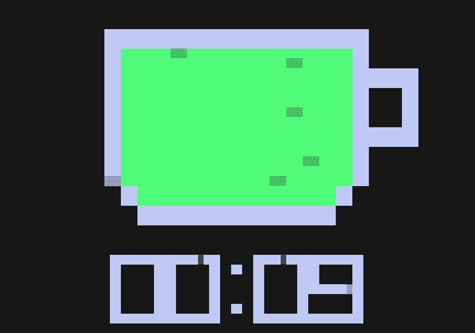
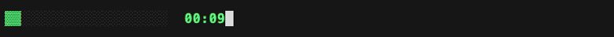

[](https://github.com/retr0h/grind/releases/latest)
[](https://goreportcard.com/report/github.com/retr0h/grind)
[](LICENSE)
[](https://github.com/retr0h/grind/actions/workflows/go.yml)
[](https://github.com/retr0h/grind/actions/workflows/release.yml)
[](https://github.com/goreleaser)
[](https://github.com/casey/just)
[](https://conventionalcommits.org)

[](https://pkg.go.dev/github.com/retr0h/grind)


<p align="center">☕ An 8-bit retro terminal timer.</p>

<p align="center">
  <a href="asset/cup.gif"></a>
</p>

A pixel-art coffee cup that drains as time runs out. Turns hot pink and pulses on expiry. Neon Max Headroom palette, vim-style exits, tmux plugin included.

## ✨ Features

- ☕ **Pixel-art coffee cup** that drains top-down as the timer runs out
- 📟 **Block-digit countdown** rendered from a hand-rolled 5×7 glyph set
- 🎨 **Random neon color** picked per launch from the Max Headroom palette
- 🔔 **Hot-pink expiry alert** — cup fills, pulses, timer flips and counts up
- ⌨️ **Vim-style exits** — `ESC`, `ZZ`, or `:q<CR>`
- 📐 **Terminal resize aware** — auto-centers on SIGWINCH
- 🖥️ Designed to live alongside your shell in tmux

## 📦 Install

```bash
curl -fsSL https://github.com/retr0h/grind/raw/main/install.sh | sh
```

Installs to `~/.local/bin` (or `/usr/local/bin` as root) — SHA256 checksums verified. Override with `GRIND_INSTALL_DIR=/some/path` or pin a version with `GRIND_VERSION=1.1.1`.

<details>
<summary>Manual install</summary>

### ⬇️ Download binary (macOS)

Grab the latest release for your architecture:

```bash
# Apple Silicon (M1/M2/M3/M4)
curl -sL https://github.com/retr0h/grind/releases/latest/download/grind_$(curl -sL https://api.github.com/repos/retr0h/grind/releases/latest | grep tag_name | cut -d '"' -f4 | tr -d v)_darwin_arm64 -o grind

# Intel Mac
curl -sL https://github.com/retr0h/grind/releases/latest/download/grind_$(curl -sL https://api.github.com/repos/retr0h/grind/releases/latest | grep tag_name | cut -d '"' -f4 | tr -d v)_darwin_amd64 -o grind

chmod +x grind
mv grind ~/.local/bin/
```

### 🔏 Verify checksum

```bash
curl -sL https://github.com/retr0h/grind/releases/latest/download/checksums.txt -o checksums.txt
grep "$(uname -s | tr A-Z a-z)_$(uname -m | sed 's/x86_64/amd64/;s/aarch64/arm64/')" checksums.txt | sed 's/grind_.*$/grind/' | shasum -a 256 -c
```

</details>

### 🔨 Build from source

```bash
git clone https://github.com/retr0h/grind.git
cd grind
go build -o grind .
install -m 755 grind ~/.local/bin/grind
```

## 🚀 Usage

### Interactive (full-screen)

```bash
grind                  # 25 minute default
grind --timer 5m       # 5 minute timer
grind --timer 1h30m    # Hour and a half
grind --timer 45s      # 45 seconds — good for quick tests
```

### Headless (tmux bar)

```bash
grind --bar --timer 5m      # run in background, drive tmux status bar only
grind stop                  # stop the running timer
grind status                # emit the tmux status-right line
```

See **Tmux integration** below for the recommended key bindings.

### ⌨️ Controls

| Key               | Action                                     |
| ----------------- | ------------------------------------------ |
| `SPACE`           | Pause / resume (while timer is running)    |
| `:`               | Open vim-style command bar                 |
| `:q<CR>` / `ZZ` / `ESC` | Quit                                 |
| `Q` / `Ctrl+C`    | Quit (quick)                               |

### 📊 Tmux integration

grind ships as a **tmux plugin**. One line in `~/.tmux.conf` sets up the
key bindings, the status bar, and the truecolor overrides.

#### Install via [TPM](https://github.com/tmux-plugins/tpm) (recommended)

```tmux
set -g @plugin 'retr0h/grind'
```

Then `<prefix> I` inside tmux to install. That's the entire setup.

#### Configurable options

```tmux
set -g @grind-binary      '/custom/path/to/grind'  # override binary location
                                                   # (default: ~/.local/bin/grind,
                                                   # falls back to $PATH lookup)
set -g @grind-launch-key  'g'   # <prefix> + this key starts a timer (default: g)
set -g @grind-stop-key    'G'   # <prefix> + this key stops the timer (default: G)
set -g @grind-status-right '1'  # '0' to opt out of auto-injecting `#(grind status)`
                                # into status-right (place it wherever you want instead)
```

#### Manual install (no TPM)

If you don't use TPM, drop the equivalent into your `~/.tmux.conf` yourself:

```tmux
set -g status-interval 1
set -g default-terminal "tmux-256color"
set -ga terminal-overrides ",*:RGB"
set -g status-right '#(grind status) | %H:%M'
bind-key g command-prompt -p "grind:" "run-shell -b 'grind --bar --timer %1'"
bind-key G run-shell 'grind stop'
```

> **Note:** you still need the `grind` binary on `$PATH` — the tmux plugin
> only wires up tmux. Install the binary via `go install github.com/retr0h/grind@latest`
> or from the releases page.

#### How it feels

Hit `<prefix> g`, type `5m` (or `45s`, `1h30m`, any Go duration), press
Enter. grind runs headless in the background. The status bar fills in left
to right, painting cells with a **semantic color gradient**: cool green at
the start, yellow and orange in the middle, pink as you approach expiry.



> Recording generated with [VHS](https://github.com/charmbracelet/vhs):
> `vhs asset/tmux-bar.tape` (see `asset/cup.tape` for the full-screen UI).

On expiry the bar strobes — every wall-clock second it alternates between
bright ▓ hot pink and dim ░ pink — and a single terminal `\a` fires so
tmux's `monitor-bell` lights up the window tab `!` and the outer terminal
emulator flashes its tab. Suppress the bell with `--no-bell`. The strobe
runs indefinitely; dismiss with `<prefix> G`.

When no timer is running, `grind status` prints nothing — tmux renders an
empty slot.

## ⚙️ How It Works

1. 🎨 **Pick a duration** — `grind --timer 25m` (any Go `time.ParseDuration` string)
2. 🎲 **Random color** — the cup is tinted orange / cyan / magenta / green / yellow at random
3. ⏳ **Watch it drain** — cup empties top-down as the clock counts down
4. 🔔 **Expiry alert** — when the clock hits 0:00 the cup re-fills with hot pink and starts **pulsing**; the digits flip pink and count **up**
5. ⌨️ **Acknowledge** — press `ESC`, `ZZ`, or `:q<CR>` to quit

## 📋 Requirements

- 🍎 macOS (terminal with ANSI + unicode block character support)
- 🐹 Go 1.21+ (to build from source)

## 💡 Inspiration

grind is the focus-timer cousin of [tlock](https://github.com/retr0h/tlock) — same 3×2 grid system, same glitch-style unicode block language, same retro CRT aesthetic. Different tool, same house style.

## 🔀 Alternatives

| Tool                                                            | Description                               |
| --------------------------------------------------------------- | ----------------------------------------- |
| [timer](https://github.com/caarlos0/timer)                      | Plain Go terminal countdown               |
| [termdown](https://github.com/trehn/termdown)                   | Python-based big-digit countdown          |
| [tty-clock](https://github.com/xorg62/tty-clock)                | Classic ncurses digital clock             |

## 🗺️ Roadmap

- [x] ☕ Pixel-art coffee cup with drain animation
- [x] 🎲 Random Max Headroom color per launch
- [x] 🔔 Hot-pink expiry pulse + count-up
- [x] ⌨️ Vim-style exits (`ESC`/`ZZ`/`:q`)
- [x] 📊 `grind status` — single-line tmux `status-right` bar matching the Claude statusline palette
- [x] ⏱️ Bar-only mode (`grind --bar`) + `grind stop` for tmux key bindings

## 📄 License

The [MIT][] License.

[MIT]: LICENSE
